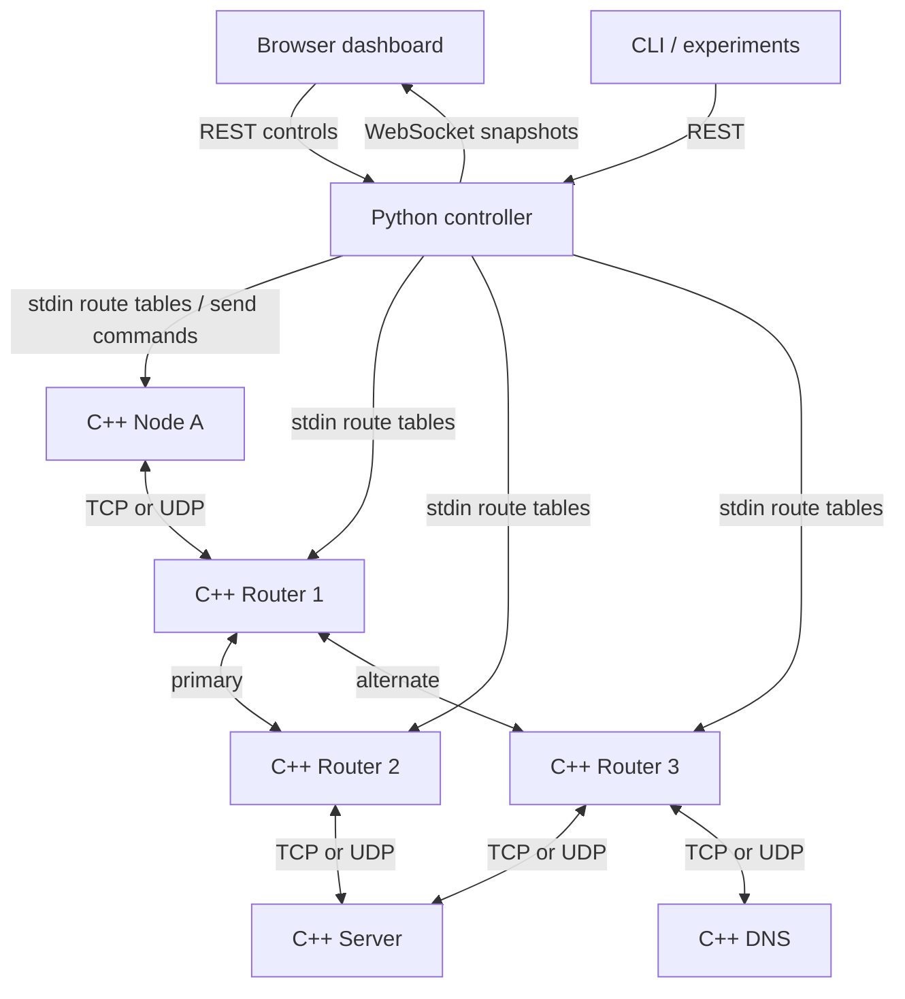

# Architecture

The application is a user-space overlay on OS sockets. Logical `10.0.0.x` addresses exist only inside its packet headers. They are not assigned to real adapters.



All C++ processes send structured event lines on stdout to the controller. This observation channel is separate from the packet data plane. Application requests are injected into a source node's stdin; their delivery and replies travel over sockets at every hop. The controller does not synthesize a response for a failed request.

## Dependencies

- `core/packet.hpp` → OpenSSL libcrypto; binary codec, IPv4 conversion, HMAC.
- `core/socket.hpp` → packet helpers and Linux/POSIX socket APIs.
- `apps/node.cpp` → packet + sockets; one process can be an endpoint, router, DNS or HTTP-like server.
- `controller/topology.py` → Python standard library; validation + weighted Dijkstra.
- `controller/network.py` → topology + `subprocess` + threading; process supervision and request correlation.
- `controller/api.py` → network + `http.server`; HTTP controls and WebSocket framing.
- `apps/cli.py` / experiments → local REST API.
- Dashboard → same-origin REST + WebSocket; no external assets.

## Process interfaces

The controller writes a simple generated config to `.runtime/<node>.conf`:

```text
node-a 10.0.0.1 127.0.0.1 5101 node udp
peer 10.0.0.10 127.0.0.1 5110
record server.local 10.0.0.50
```

`OPENNET_KEY` is inherited through the environment, not the command line. The controller generates a fresh random key at each startup. Commands are newline-delimited ASCII:

- `ROUTES destination next_hop [destination next_hop ...]`: atomic route-table replacement.
- `SEND id type destination ttl payload_hex`: inject one application packet.
- `FAULT loss_probability delay_ms`: update per-forward impairment.
- `STOP`: terminate the process.

The core never reads dashboard state. It forwards only using its own installed table. Sending ROUTES down a pipe confirms dispatch, not an atomic network-wide route transaction. `routes_updated` events confirm process application. Transient failures during convergence are possible and requests are not retried.

## Routing and failures

Dynamic mode applies weighted Dijkstra independently from each source. Endpoints can originate/receive, but only routers can be intermediate vertices. A process emits a monitoring heartbeat every second and sends authenticated UDP HEARTBEAT packets to each configured neighbor. Neighbor discovery is a startup announcement to these same configured peers.

The controller detects missing process heartbeats (SUSPECTED >2s; FAILED >3.2s), receives peer-down events (>3s), withdraws unavailable vertices/edges and sends new tables. A restarted process announces itself and resumes heartbeats. Costs choose the primary route through Router 2 and the fallback through Router 3.

Static mode installs the paths explicitly listed in its configuration and leaves them unchanged when a router fails. It provides a controlled comparison with dynamic recovery.

## Observability

Each event includes a node, event kind and epoch timestamp. Packet events include request ID, type, source, destination, TTL and hex payload. ID remains the same for the request and its reply. An event sequence is assigned on controller receipt; timestamps sort cross-process traces. Wall-clock changes or unsynchronized remote clocks can affect their ordering. API RTT uses Python's monotonic performance clock, includes control-plane and process scheduling overhead, and excludes the 20ms stdout-drain interval used before returning a trace.

Packet counters exclude peer heartbeat traffic. Bytes are encoded overlay bytes, excluding TCP frame headers, OS headers and retransmissions. Counters reset on node restart; aggregate counters sum the current process counters. Completed-request counters are controller-session totals. CPU time and RSS come from Linux `/proc`, when available; CPU time is cumulative seconds, not a percentage.

The event deque holds 1,500 events; WebSocket snapshots contain the newest 180, and the dashboard shows 60 filtered entries. Full events append to `.runtime/events.jsonl`; this log is unrotated in this release. At high rates the dashboard intentionally samples the bounded event window and at most 30 new pulse animations per update. The log is the more complete trace source.

## Engineering tradeoffs

- The process event loop uses `poll` for UDP, TCP listener and stdin. Accepted TCP reads/connects have 250ms bounds.
- TCP opens a connection per forwarded packet. This is easy to inspect but not throughput optimized.
- Loss/delay acts on application forwards and replies, not heartbeats. Delay blocks the node event loop and can itself delay heartbeats under sustained load.
- Administrative link-down removes routes; it is not a firewall rule blocking socket traffic. Static routing ignores these withdrawals.
- Per-session shared HMAC key authenticates membership, not unique node identity, and does not encrypt or prevent replay.
- Configurable bind hosts prepare the socket layer for LAN use. Distributed supervision and remote telemetry remain unimplemented.
